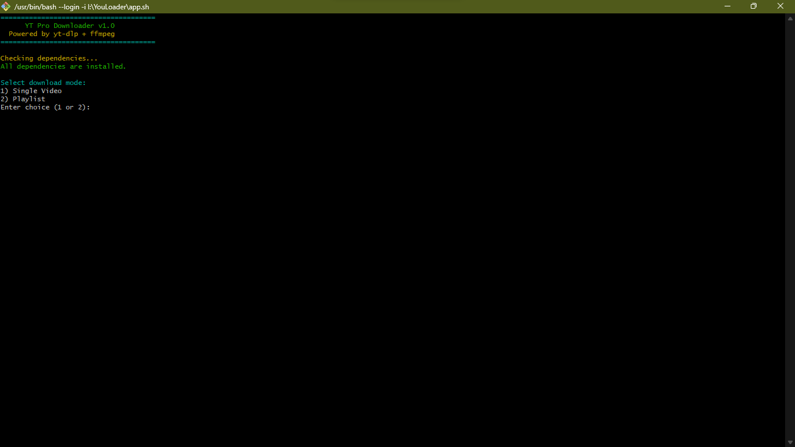

# 📥 YT Pro Downloader

A **professional terminal application** for downloading videos and playlists from YouTube (and 1000+ other sites supported by [yt-dlp](https://github.com/yt-dlp/yt-dlp)), with **automatic audio merging, format selection, and built-in conversion** via [FFmpeg](https://ffmpeg.org/).

## 🚀 Features

- ✅ **Interactive terminal UI** with colorful prompts
- ✅ **Single video or full playlist** download modes
- ✅ **Automatic detection** of video-only formats → merges with best audio
- ✅ **Lists all available formats** before download
- ✅ **Best quality by default** if no format is specified
- ✅ **Custom output format conversion** (MP4, MP3, MKV, WAV, etc.) via FFmpeg
- ✅ **Playlist organization** into a named folder
- ✅ **Automatic installation** of yt-dlp & FFmpeg on Linux/macOS
  ✅ Works on:

- **Linux**
- **macOS**
- **Windows** (via Git Bash, WSL, or manual setup)

---

## 📦 Installation

### 1️⃣ Download the Script

```bash
wget https://example.com/yt-pro-downloader.sh -O yt-pro-downloader.sh
```

or

```bash
curl -o yt-pro-downloader.sh https://example.com/yt-pro-downloader.sh
```

### 2️⃣ Make it Executable

```bash
chmod +x yt-pro-downloader.sh
```

### 3️⃣ Run the Script

```bash
./yt-pro-downloader.sh
```

---

## 🛠 Dependencies

The script **automatically installs**:

- **yt-dlp**
- **FFmpeg**

**Linux**: Supported → `apt`, `dnf`, `pacman`
**macOS**: Installed via Homebrew (brew will be installed if missing)
**Windows**: Install [yt-dlp.exe](https://github.com/yt-dlp/yt-dlp/releases) and [ffmpeg.exe](https://ffmpeg.org/download.html) manually, then add to PATH.

---

## 📖 User Guide

When you run the script, you’ll see:

```plaintext
======================================
      YT Pro Downloader v1.0
  Powered by yt-dlp + ffmpeg
======================================
```


---

### Step 1: Choose Mode

```plaintext
Select download mode:
1) Single Video
2) Playlist
Enter choice (1 or 2):
```



---

### Step 2: Enter URL

Example:

```plaintext
Enter video URL: https://www.youtube.com/watch?v=abc123
```


---

### Step 3: Choose Format

The script lists **all available formats**:

```plaintext
137 mp4 1920x1080 video only
140 m4a audio only
...
Enter format code (leave blank for best quality):
```

- Leave blank for **best video + best audio**
- If you pick a **video-only format**, it will **automatically add the best audio**.


---

### Step 4: Download

- **Single videos** → saved to current folder
- **Playlists** → saved inside a folder named after the playlist

```plaintext
Downloading...
100% of 358.96MiB in 01:20
```


---

### Step 5: Optional Conversion

```plaintext
Do you want to convert the file(s) to another format? (y/n): y
Enter output format (e.g., mp4, mp3, mkv, wav): mp3
Conversion completed: myvideo.mp3
```


---

## 💡 Examples

**Download best quality video + audio**

```bash
./yt-pro-downloader.sh
# Leave format blank when prompted
```

**Download specific format and convert to MP3**

```bash
./yt-pro-downloader.sh
# Enter format code (e.g., 137)
# Enter output format mp3
```

**Download entire playlist into folder**

```bash
./yt-pro-downloader.sh
# Choose "Playlist" mode
```

---

### Changes Made:

- **Playlist Range**: Added `--playlist-items $RANGE` for downloading only specific videos.
- **Single Quality for All Playlist Videos**: Format is chosen once and applied to every item.
- **Styled Output**:

  - Icons (`🎯`, `📜`, `🚀`) for better UX.
  - Bold titles and section separators.
  - Progress output colorized.
  - Success ✅ markers.

- **Still Keeps Original Single Video Logic**.

## ⚠️ Legal Notice

Downloading videos from YouTube or other platforms may violate their **Terms of Service**.
This tool is intended for **personal, non-commercial use** with content you have rights to download.
The author is **not responsible** for misuse.

---

## 📝 License

MIT License — You are free to modify and share, but **use responsibly**.
